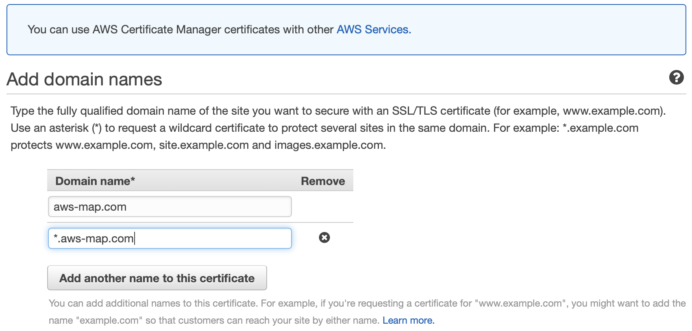

# Serverless-React-PWA-on-AWS

> How to create a serverless Progressive Web App, using React, Redux, React Router, TypeScript on frontend and AWS Lambda, Cloudfront, Amazon SES, API Gateway for a zero maintenance required backend.

## Route53

Create *your-domain.com* hosted zone and configure domain provider with AWS name servers.

On *Route53*:


On your domain provider:


## SSL Certificate

Go to *Certificate Manager* AWS service. Request an SSL certificate for _your-domain.com_ and
add also a wildcard domain _*.your-domain.com_.



Choose DNS validation option, and click on *Create record in Route 53* button
for both naked domain and wildcard domain.


## Simple Email Service

First of all, verify *your-domain.com* domain. Go to *SES > Domains* and click *Verify a New Domain*.
When the DSN records are prompted, click on *Use Route 53*.


It should take few minutes to validate. Well done! Now it's time to start coding.

## Start coding

Create your git repo and init an npm package.

```bash
npm init
```

You may want to make it private, add in your *package.json*

```json
  "private": true,
```

If it is not a package to be installed as a dependency, I also like to disable *package-lock.json*.
Create a *.npmrc* file with the following content.

```
package-lock=false
```

Of course, create a *.gitignore* file, you can start with the following content

```
node_modules
```

Before start coding, I would go for [EditorConfig](http://EditorConfig.org).
Do not think it twice, you can add a *.editorconfig* file just launching

```bash
npm i dot-editorconfig -D
```

Install *typescript* and related packages.

```bash
npm i tslib tslint typescript @types/node -D
```

Create the following *tsconfig.json* file in your project root folder.

```json
{
  "compilerOptions": {
    "allowJs": false,
    "charset": "utf8",
    "esModuleInterop": true,
    "importHelpers": true,
    "module": "commonjs",
    "noImplicitUseStrict": true,
    "removeComments": true,
    "sourceMap": false,
    "strictNullChecks": true,
    "target": "es2017"
  }
}
```

Create *tslint.json* file too: I would start with the following configuration:

```json
{
  "extends": ["tslint:latest"],
  "rules": {
    "member-access": [true, "no-public"],
    "no-implicit-dependencies": [true, "dev"],
    "ordered-imports": [true,
      {
        "named-imports-order": "lowercase-first"
      }
    ],
    "semicolon": [true, "never"],
    "trailing-comma": false
  }
}
```

Add the following scripts to your *package.json*:

```json
  "scripts": {
    "tsc--noemit": "tsc --declaration --project . --noemit",
    "tslint": "tslint --project ."
  }
```

And now, the fundamentalist (I am kidding:)) part: add a commit hook that run those basic checks. Install *pre-commit*:

```bash
npm i pre-commit -D
```

Add the following to your *package.json*:

```json
  "pre-commit": [
    "tsc--noemit",
    "tslint"
  ],
```

And now a git hook will run those npm scripts on commit. You can bypass it with `git commit -n`.

Install *aws-sdk* for JavaScript.

```bash
npm i aws-sdk -D
```

Write code to send emails, take a look at the following implementation:

* [api/sendEmail.ts](https://github.com/fibo/aws-map.com/blob/Serverless-React-PWA-on-AWS/api/sendEmail.ts)
* [api/emailTemplates.ts](https://github.com/fibo/aws-map.com/blob/Serverless-React-PWA-on-AWS/api/emailTemplates.ts)

Notice the *api/domainNames.ts* file that exports the `nakedDomain` variable, you may want to customize with your awesome domain.

Ok, let's give it a try. Create a file, for instance *sendMyFirstEmail.ts*, with a snippet like this

```typescript
import { sendCreateAccountEmail } from "./path/to/your/api/sendEmail"

sendCreateAccountEmail("your_email@gmail.com", "123", (err, data) => {
  if (err) throw err

  console.log(data)
})
```

Make it simple, just install TS stuff globally.

```bash
npm i ts-node typescript -g
```

Then send you email with:

```typescript
$ ts-node sendMyFirstEmail.ts
{ ResponseMetadata: { RequestId: 'a5eb6749-82ff-11e9-8d59-578481efc51f' },
  MessageId:
   '0100016b09c4ab82-db581946-60df-43fd-b56c-19ece2a0d2d1-000000' }
```

Yay, email arrived... a new company is being born...

Let me share this lesson I learned. This procedure works with *dot com*, and also *dot net* and maybe *dot info* domains. Well, I bought this domain: *geoch.at*. It did not worked.
I was not able to use Amazon SES with a *dot at* domain. Domain hacking is fun, but it is not worth for a company. Just get a *dot com* domain name.
People still don't get domain hacking, they expect a *dot com*. What a pity, I like so much Moldovian domain extension, ahahaha.

Ok, now that we can send emails, we can create a customer base. You may want to choose other authentication methods, for example via SMS, via GitHub, etc.
But let's use good old emails.

We are going to create the following lambdas:

* [create-account](https://github.com/fibo/aws-map.com/tree/master/api/lambdas/create-account)
* [enter-account](https://github.com/fibo/aws-map.com/tree/master/api/lambdas/enter-account)
* [reset-password](https://github.com/fibo/aws-map.com/tree/master/api/lambdas/reset-password)
* [verify-email](https://github.com/fibo/aws-map.com/tree/master/api/lambdas/verify-email)

