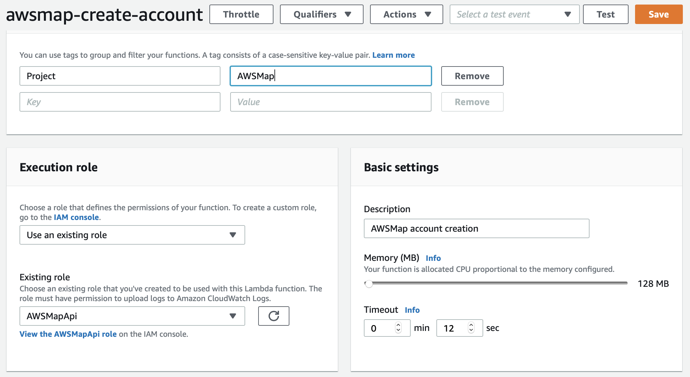
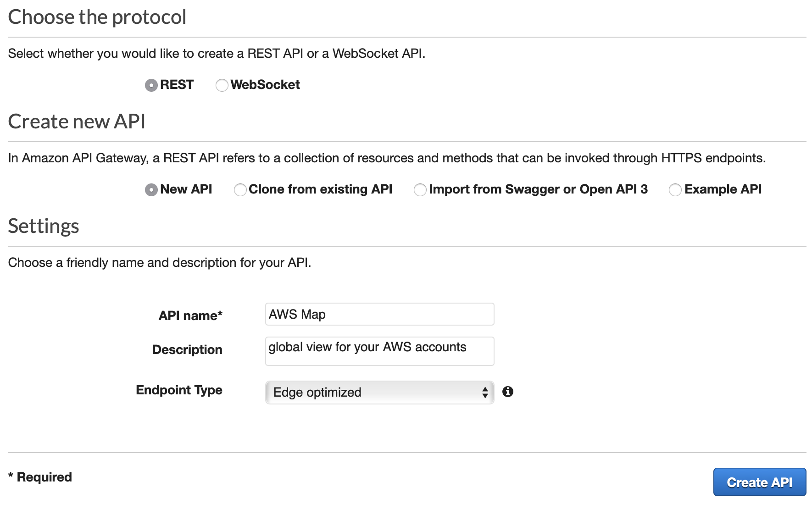
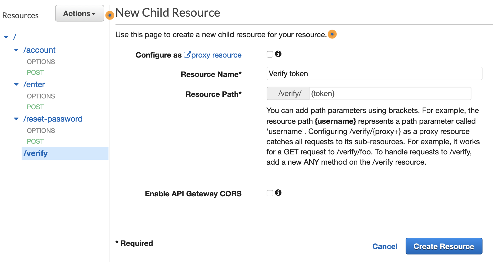
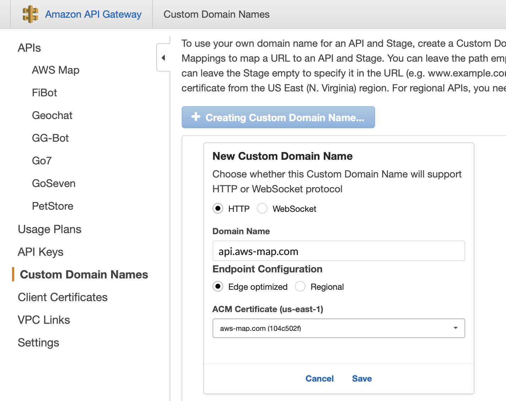
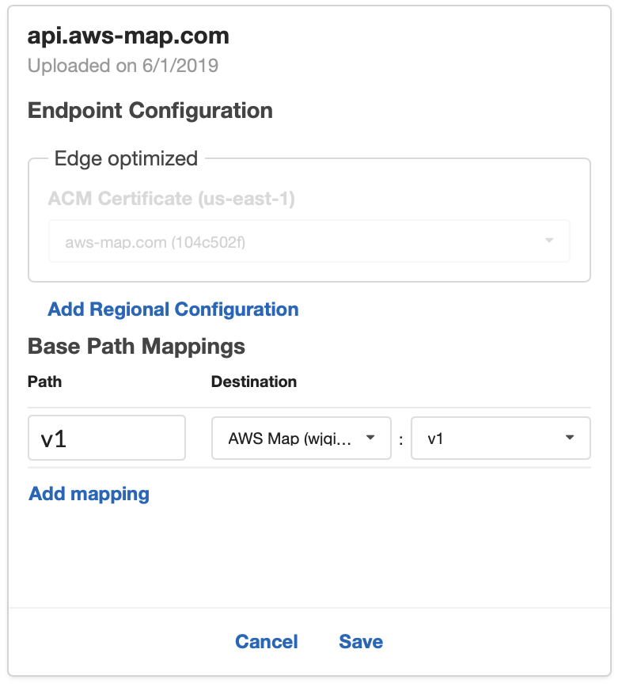
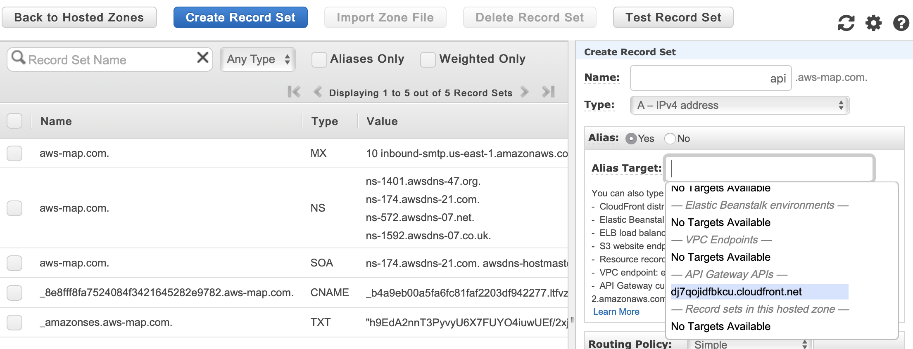
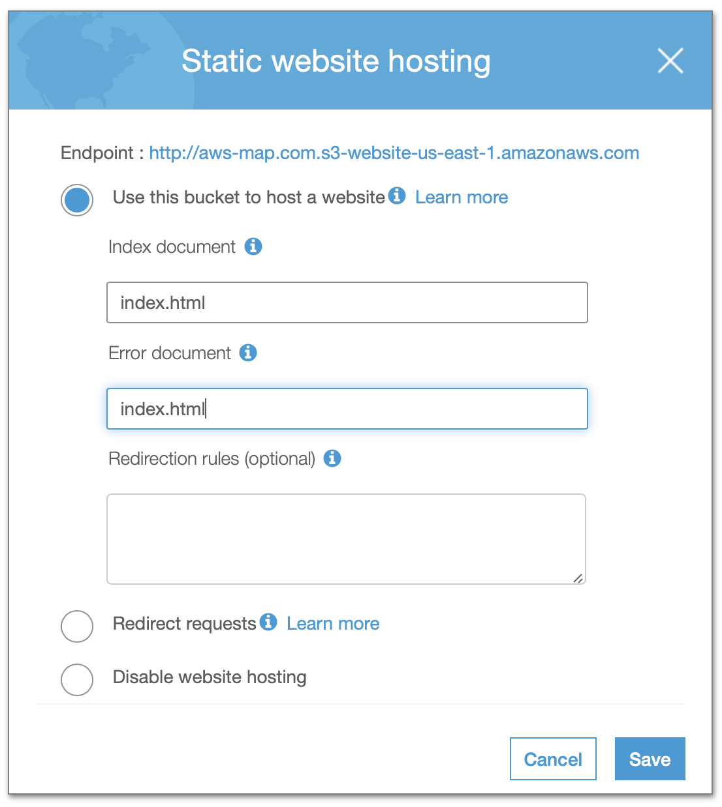
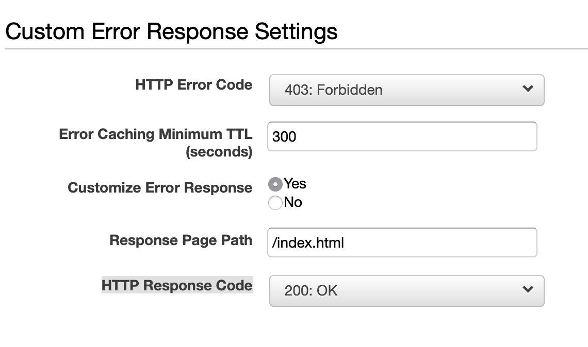

# Serverless-React-PWA-on-AWS

> How to create a serverless Progressive Web App, using React, Redux, React Router, TypeScript on frontend and AWS Lambda, CloudFront, Amazon SES, API Gateway for a zero maintenance required backend.

## Step zero

Read https://react-pwa.github.io tutorial first.

## Brand

You need a *project name*, possibly matching your domain. This name will be used everywhere in different contexts: as is, lowercase, without spaces, as a prefix etc.
Project name in the following snippets will be **Acme**. Actually there is a side project of mine,
that implements this tutorial and some links below point to it: [fibo/aws-map.com](https://github.com/fibo/aws-map.com). In that case you may find its name, that is *AWS Map*.

## Route53

Create *your-domain.com* hosted zone and configure domain provider with AWS name servers.

On *Route53*:


On your domain provider:


## SSL Certificate

Go to *Certificate Manager* AWS service. Request an SSL certificate for _your-domain.com_ and
add also a wildcard domain _*.your-domain.com_.


Choose DNS validation option, and click on *Create record in Route 53* button
for both naked domain and wildcard domain.


## Simple Email Service

First of all, verify *your-domain.com* domain. Go to *SES > Domains* and click *Verify a New Domain*.
When the DSN records are prompted, click on *Use Route 53*.


It should take few minutes to validate. Well done! Now it's time to start coding.

## Start coding

Create your git repo and init an npm package.

```bash
npm init
```

You may want to make it private, add in your *package.json*

```json
  "private": true,
```

If it is not a package to be installed as a dependency, I also like to disable *package-lock.json*.
Create a *.npmrc* file with the following content.

```
package-lock=false
```

Of course, create a *.gitignore* file, you can start with the following content

```
node_modules
```

Before start coding, I would go for [EditorConfig](http://EditorConfig.org).
Do not think it twice, you can add a *.editorconfig* file just launching

```bash
npm i dot-editorconfig -D
```

Install *typescript* and related packages.

```bash
npm i tsify tslint tslint-react typescript @types/node -D
```

Create the following *tsconfig.json* file in your project root folder.

```json
{
  "compilerOptions": {
    "allowJs": false,
    "charset": "utf8",
    "esModuleInterop": true,
    "jsx": "react",
    "module": "commonjs",
    "noImplicitUseStrict": true,
    "removeComments": true,
    "sourceMap": false,
    "strictNullChecks": true,
    "target": "es2017"
  },
  "include": [
    "api/**/*",
    "pwa/**/*"
  ]
}
```

Create *tslint.json* file too: I would start with the following configuration:

```json
{
  "extends": ["tslint:latest", "tslint-react"],
  "rules": {
    "curly": [true, "ignore-same-line"],
    "jsx-boolean-value": false,
    "member-access": [true, "no-public"],
    "no-console": false,
    "no-implicit-dependencies": [true, "dev"],
    "ordered-imports": [true,
      {
        "named-imports-order": "lowercase-first"
      }
    ],
    "semicolon": [true, "never"],
    "trailing-comma": false
  }
}
```

Add the following scripts to your *package.json*:

```json
  "scripts": {
    "tsc--noemit": "tsc --declaration --project . --noemit",
    "tslint": "tslint --project .",
  }
```

And now, the fundamentalist (I am kidding:)) part: add a commit hook that run those basic checks. Install *pre-commit*:

```bash
npm i pre-commit -D
```

Add the following to your *package.json*:

```json
  "pre-commit": [
    "tsc--noemit",
    "tslint"
  ],
```

And now a git hook will run those npm scripts on commit. You can bypass it with `git commit -n`.

Install *aws-sdk* for JavaScript.

```bash
npm i aws-sdk
```

Write code to send emails, take a look at the following implementation:

* [api/sendEmail.ts](https://github.com/fibo/aws-map.com/blob/Serverless-React-PWA-on-AWS/api/sendEmail.ts)
* [api/emailTemplates.ts](https://github.com/fibo/aws-map.com/blob/Serverless-React-PWA-on-AWS/api/emailTemplates.ts)

Notice the *api/domainNames.ts* file that exports the `nakedDomain` variable, you may want to customize with your awesome domain.

Ok, let's give it a try. Create a file, for instance *sendMyFirstEmail.ts*, with a snippet like this

```typescript
import * as sendEmail from "./path/to/your/api/sendEmail"

async function sendMyFirstEmail() {
  try {
    const response = await sendEmail.createAccount("your_email@gmail.com", "123")

    console.log(response)
  } catch (error) {
    throw error
  }
}

sendMyFirstEmail()
```

Make it simple, just install TS stuff globally.

```bash
npm i ts-node typescript -g
```

Then send you email with:

```typescript
$ ts-node sendMyFirstEmail.ts
{ ResponseMetadata: { RequestId: 'a5eb6749-82ff-11e9-8d59-578481efc51f' },
  MessageId:
   '0100016b09c4ab82-db581946-60df-43fd-b56c-19ece2a0d2d1-000000' }
```

Yay, email arrived... a new company is being born...

Let me share this lesson I learned. This procedure works with *dot com*, and also *dot net* and maybe *dot info* domains. Well, I bought this domain: *geoch.at*. It did not worked.
I was not able to use Amazon SES with a *dot at* domain. Domain hacking is fun, but it is not worth for a company. Just get a *dot com* domain name.
People still don't get domain hacking, they expect a *dot com*. What a pity, I like so much Moldovian domain extension, ahahaha.

Ok, now that we can send emails, we can create a customer base. You may want to choose other authentication methods, for example via SMS, via GitHub, etc.
But let's use good old emails.

First we need to finish our setup.

## AWS CLI profile

Install [AWS CLI](https://github.com/aws/aws-cli).

**NOTA BENE**: AWS region is assumed to be **us-east-1**, also in AWS console region dropdown.

Get your AWS account id but we do not want to hardcode it. It is better to set it as an environment variable.

```bash
export AWS_ACCOUNT_ID=123...
```

Get also AWS API keys and set them into your environment variables, it will be needed during development.

```bash
export AWS_ACCESS_KEY_ID=***
export AWS_SECRET_ACCESS_KEY=***
export AWS_DEFAULT_REGION=us-east-1
```

Set the environment variables above in your shell profile. For example [in my MacOS I use bash](https://g14n.info/2019/05/my-mac-terminal/) and they are configured in my *~/.bash_profile*.

We need also two other environment variables, but we can set them when needed, in particular when we create lambdas or want to run some code locally to debug it:

* `JWT_SECRET`: should be a long random string
* `AWS_REGION`: set to *us-east-1*.

Create (only once) the AWS CLI `Acme` profile locally. Remember that *Acme* is just a fake name, for instance in my side project I launched `aws configure --profile AWSMap`.

```bash
$ aws configure --profile Acme
AWS Access Key ID [None]: ***
AWS Secret Access Key [None]: ***
Default region name [None]: us-east-1
Default output format [None]:
```

### IAM

Create the following script: api/iam/generate-files.ts.

It imports few strings from the following files:

* [api/domainNames.ts](https://github.com/fibo/aws-map.com/blob/Serverless-React-PWA-on-AWS/api/domainNames.ts)
* [api/dynamo.ts](https://github.com/fibo/aws-map.com/blob/Serverless-React-PWA-on-AWS/api/dynamo.ts)
* [api/region.ts](https://github.com/fibo/aws-map.com/blob/Serverless-React-PWA-on-AWS/api/region.ts)

So you can create the imported files adding only what is needed, for instance

```typescript
// api/domainNames.ts
export const nakedDomain = "your-domain.com"
```

```typescript
// api/dynamo.ts
export const tableNamePrefix = "Acme"
```

```typescript
// api/region.ts
export const region = "us-east-1"
```

Make sure required environment variables are set properly, then run it

```bash
ts-node api/iam/generate-files.ts
```

In your root repository folder *package.json* add the following scripts.

```json
  "scripts": {
    "iam_attach_policy": "aws iam attach-role-policy --policy-arn arn:aws:iam::${AWS_ACCOUNT_ID}:policy/${npm_package_config_policy} --role-name ${npm_package_config_role} --profile ${npm_package_config_profile}",
    "iam_create_role": "aws iam create-role --role-name ${npm_package_config_role} --assume-role-policy-document file://api/iam/trust-service.json --profile ${npm_package_config_profile}",
    "iam_create_policy": "aws iam create-policy --policy-name ${npm_package_config_policy} --policy-document file://api/iam/lambda-policy.json --profile ${npm_package_config_profile}",
  }
```

Create also a new *config* attribute, changing of course the values according to your *project name*.

```json
  "config": {
    "role": "AcmeApi",
    "policy": "AcmeLambda",
    "profile": "Acme"
  },
```

Create role and attach policies.

```bash
npm run iam_create_role
npm run iam_create_policy
npm run iam_attach_policy
```

## AWS Lambdas

We are going to use no framework for our AWS lambdas. In my opinion, AWS is the framework: it is not worth to add another layer on top. I just used npm scripts and few helper functions.

Let's start with a dummy lambda, you can check the final implementations in the links below:

* [create-account](https://github.com/fibo/aws-map.com/tree/Serverless-React-PWA-on-AWS/api/lambdas/create-account)
* [enter-account](https://github.com/fibo/aws-map.com/tree/Serverless-React-PWA-on-AWS/api/lambdas/enter-account)
* [reset-password](https://github.com/fibo/aws-map.com/tree/Serverless-React-PWA-on-AWS/api/lambdas/reset-password)
* [verify-email](https://github.com/fibo/aws-map.com/tree/Serverless-React-PWA-on-AWS/api/lambdas/verify-email)

Every lambda has its own folder and a *package.json*. The code inside is up to you, but you needd to consider
that, even if you use plain JavaScript, you need some *build/* folder to create a **zip** file to be uploaded on AWS.

We are going to use TypeScript so, at the time of this writing, we need to transpile it, cause there is no TypeScript runtime on AWS Lambda yet 🤔. We have hence the following files:

* *package.json*
* *.npmrc*: contains `package-lock=false`
* *index.ts*

The main idea year is that an AWS Lambda is implemented in an npm package of its own;
for example in other projects I created a *src/* folder, and used JavaScript; programming is a creative process... you know

Add the following to the *.gitignore* in your repository.

```
# lambdas
build.zip
build/
```

All lambdas will be prefixed with the project name, for instance **acme-**. Here it is a sample *package.json* for *create account* lambda. It is worth to repeat that *Acme* in the following snippet should be changed with your *project name*... or you could just simplify and actually create the [Acme Corporation](https://en.wikipedia.org/wiki/Acme_Corporation).
You may also change the *author*, or you could give me undeserved credits (or make me the owner of Acme Corporation :) as well as the *license*, in case you want to create an OSS projec.

```json
{
  "name": "acme-create-account",
  "version": "0.0.0",
  "description": "Acme account creation",
  "private": true,
  "main": "index.ts",
  "scripts": {
    "browserify": "browserify --node -x aws-sdk -p tsify -o build/index.js -s exports $npm_package_main",
    "create": "aws lambda create-function --region ${AWS_REGION} --profile ${npm_package_config_profile} --function-name ${npm_package_name} --description \"${npm_package_description}\" --runtime nodejs8.10 --handler index.handler --role arn:aws:iam::${AWS_ACCOUNT_ID}:role/${npm_package_config_role} --zip-file fileb://build.zip",
    "create_log_group": "aws logs create-log-group --log-group-name /aws/lambda/$npm_package_name",
    "delete": "aws lambda delete-function --region $npm_package_config_region --profile $npm_package_config_profile --function-name $npm_package_name",
    "delete_log_group": "aws logs delete-log-group --log-group-name /aws/lambda/$npm_package_name",
    "deploy": "aws lambda update-function-code --region ${npm_package_config_region} --profile ${npm_package_config_profile} --function-name ${npm_package_name} --zip-file fileb://build.zip",
    "postcreate": "npm run create_log_group; npm run set_timeout",
    "prebrowserify": "rm -rf build; mkdir build",
    "postcreate_log_group": "npm run set_log_retention",
    "postdelete": "npm run delete_log_group",
    "precreate": "npm run zip",
    "predeploy": "npm run zip",
    "prezip": "rm build.zip; npm install; npm run browserify",
    "set_environment": "aws lambda update-function-configuration --region ${npm_package_config_region} --profile ${npm_package_config_profile} --function-name ${npm_package_name} --environment \"Variables={JWT_SECRET=$JWT_SECRET}\"",
    "set_log_retention": "aws logs put-retention-policy --region ${npm_package_config_region} --log-group-name /aws/lambda/$npm_package_name --retention-in-days $npm_package_config_log_retention",
    "set_timeout": "aws lambda update-function-configuration --region ${npm_package_config_region} --profile ${npm_package_config_profile} --function-name ${npm_package_name} --timeout ${npm_package_config_timeout}",
    "test": "echo \"Error: no test specified\" && exit 1",
    "zip": "cd build; zip -X -r ../build.zip * > /dev/null; cd .."
  },
  "config": {
    "log_retention": 7,
    "profile": "Acme",
    "region": "us-east-1",
    "role": "AcmeApi",
    "timeout": 12
  },
  "author": "Gianluca Casati (http://g14n.info)",
  "license": "UNLICENSED",
  "dependencies": {},
  "peerDependencies": {
    "aws-lambda-res": "^1.0.0"
  },
  "devDependencies": {
    "browserify": "^16.2.3"
  }
}
```

Start with a dummy *index.ts*, it just respond with 200 HTTP status code and `{ "ok": true }` JSON payload.

```typescript
import response from "aws-lambda-res"

export async function handler(event, context) {
  return response(200)({ ok: true })
}
```

Install this little helper, in your project root folder run

```bash
npm i aws-lambda-res
```

Now let's create our first lambda, remember to set the environment variables needed

```bash
export AWS_REGION=us-east-1
export JWT_SECRET=someSECRETrandomStringYouShouldAvo1dStor3AndPoss1blyChange1Toften
```

So, if TypeScript has no complains, launching npm script

```bash
npm run create
```

Will install deps, transpile code, generate a *build.zip* and upload it on AWS creating a function.
On success, it will also run scripts

```bash
npm run create_log_group
npm run set_timeout
npm run set_log_retention
```

Then you need to launch the following script

```bash
npm run set_environment
```

I prefer to launch it separately, cause it is worth to double check environment is set properly, rather
than trigger it on *postcreate*.

Another task I prefer to do manually, even if it could be automated, is:

1. Go on AWS Console and check that the AWS Lambda function was created as expected, on the desired region and so on...
2. Set a *Project* tag, for instance *Acme*. It will be handy to filter resources as well as separate budget.



Ah, I forgot... you remember the pain and glory path... well I also use to create a Lambda that handles `OPTIONS` methods.

* [http-options](https://github.com/fibo/aws-map.com/tree/Serverless-React-PWA-on-AWS/api/lambdas/http-options)

## API Gateway

Go to API Gateway and create a new API. Yes I know, nothing is implemented yet but I like to create dummy things that do nothing but work. It also may take some time to get your domain propagated, so it is worth to do it as soon as possible, trust me.



Create the following resources and methods

* `/account`: "POST",
* `/enter`: "POST",
* `/reset-password`: "POST",
* `/verify/{token}`: "GET",

Actually, we will need also `PUT /account` to update user settings and `DELETE /account` if a user dismiss the service. By now the endpoints above are enough to let the user register and login.
For every resource we also need to add an `OPTION` method.
Always flag **Use Lambda Proxy integration**.


Resources can be nested and have placeholders.



Now do this: *Actions > Deploy API*. When prompt ask for *stage*, create a new one and name it `v1`.
Then go to *Custome Domain Names* and create a new domain for your api, you may want *api.your-domain.org*.
Select previously created **ACM Certificate** and save.



You will see a spinner that says *Initializing...*, AWS is creating a CloudFront distribution (not listed on CloudFront service console).
Click on *Edit* and add a base path mapping.



Finally go to *Route53*, select your domain hosted zone and click on *Create Record Set*. It will be **api**,
Type A, Alias: Yes. In the alias target dropdown you should see something like *dj7qojidfbkcu.cloudfront.net* that must correspond to the *Target Domain Name* in your *API Gateway* custom domain.
By the way, right now I still see the spinner on API Gateway but on Route53 I am already able to create the record set.



In case you need to update a lambda function, change into its directory and run

```bash
npm run deploy
```

**NOTA BENE** There is no need to re deploy API Gateway.

Test it! Now you should be able to send verification email (the first email you sent) and click on verification link.

## DynamoDB

Let's move forward, yes it will take some time even create the basic structure. The good new is that once
created, this architecture require almost zero effort to maintain.

So, let's create out user table. Take a look at [api/createTables.ts](https://github.com/fibo/aws-map.com/blob/Serverless-React-PWA-on-AWS/api/createTables.ts). Try to launch

```bash
ts-node api/createTables.ts
```

Our authentication is based on [JWT](https://jwt.io), install related package as dependency

```bash
npm i jsonwebtoken
```

## React boilerplate

We are going to use budo and browserify, yeah!

Our goal here is to create a minimal *React* app using *React Router* and deploy it on *CloudFront*.
Then your app will grow in the direction you want, adding more dependencies and features, evolving according to your requirements.

Install some frontend dependencies.

```bash
npm i budo browserify tsify react react-dom react-router-dom @types/react @types/react-redux @types/react-router-dom -D
```

Start creating the following files:

* public/js/.gitignore
* public/index.html
* pwa/index.tsx
* pwa/Root.tsx
* pwa/pages/CreateAccount.tsx
* pwa/pages/Enter.tsx
* pwa/pages/Home.tsx


### public/js/.gitignore

```
*
```

### public/index.html

```html
<!DOCTYPE html>
<html>
  <head>
    <meta charset="UTF-8">

    <meta name="viewport" content="width=device-width, initial-scale=1">
  </head>

  <body>
    <div id="root"></div>

    <script src="/js/bundle.js" defer></script>
  </body>
</html>
```

### pwa/index.tsx

```typescript
import * as React from "react"
import { render } from "react-dom"

import Root from "./Root"

window.addEventListener("load", () => {
  // Mount app.
  render(<Root />, document.getElementById("root"))
})
```

### pwa/Root.tsx

```typescript
import * as React from "react"
import { IntlProvider } from "react-intl"
import { Provider } from "react-redux"
import {
  BrowserRouter,
  Redirect,
  Route,
  Switch,
} from "react-router-dom"

import CreateAccountPage from "./pages/CreateAccount"
import EnterPage from "./pages/Enter"
import HomePage from "./pages/Home"

export default class Root extends React.Component {
  render() {
    return (
      <BrowserRouter>
        <Switch>
          <Route component={CreateAccountPage} exact path={CreateAccountPage.path} />

          <Route component={EnterPage} exact path={EnterPage.path} />

          <Route component={HomePage} exact path={HomePage.path} />

          <Redirect from="*" to={HomePage.path} />
        </Switch>
      </BrowserRouter>
    )
  }
}
```

### pwa/pages/CreateAccount.tsx

```typescript
import * as React from "react"

class CreateAccountPage extends React.Component {
  static path = "/create-account"

  render() {
    return (
      <div>
        Create account
      </div>
    )
  }
}

export default CreateAccountPage
```

### pwa/pages/Enter.tsx

```typescript
import * as React from "react"

class EnterPage extends React.Component {
  static path = "/enter"

  render() {
    return (
      <div>
        Enter account
      </div>
    )
  }
}

export default EnterPage
```

### pwa/pages/Home.tsx

```typescript
import * as history from "history"
import * as React from "react"
import { Link } from "react-router-dom"

import CreateAccountPage from "./CreateAccount"
import EnterPage from "./Enter"

class HomePage extends React.Component {
  static path = "/"

  render() {
    return (
      <div>
        <Link to={CreateAccountPage.path}>Register</Link>

        <Link to={EnterPage.path}>Login</Link>
      </div>
    )
  }
}

export default HomePage
```

### Deploy now

As you can see it is an almost empty React app using the router. Add the following npm scripts to your *package.json*:

```json
  "script": {
    "deploy": "aws s3 sync public s3://your-domain.com --profile ${npm_package_config_profile} --exclude '.gitignore'",
    "start": "budo pwa/index.tsx --live --pushstate --dir public --serve js/bundle.js --open -- -p tsify",
  }
```

Notice that you need to replace *your-domain.com*. Now if you launch

```bash
npm start
```

your default browser will open and you will see your app, the router is working as expected.

Now we are going to deploy it on AWS. Yes, go live as soon as possible and deploy continuosly.

Create a *your-domain.com* S3 bucket. Upload *public/index.html* with command

```bash
npm run deploy
```

Go to bucket *Properties* tab and enable *Static website hosting*; flag the *Use this bucket to host a website*
and set for both *Index document* and *Error document* the string **index.html**.



Go to *Permissions* tab and set *Block all public access* to **off**. Then in *Bucket Policy* insert a JSON like the following

```json
{
    "Version": "2012-10-17",
    "Statement": [
        {
            "Effect": "Allow",
            "Principal": "*",
            "Action": "s3:GetObject",
            "Resource": "arn:aws:s3:::your-domain.com/*"
        }
    ]
}
```

This will make *your-domain.com* bucket public. Remembering that you need to substitute with your actual domain, you
should be already be able to see something on default S3 domain provided by AWS, something like

* http://your-domain.com.s3-website-us-east-1.amazonaws.com

Ok, we want a naked domain served over HTTPS. Go to *CloudFront* and click *Create Distribution*, then choose *Web*.

Set the following options, for other choices keep defaults by now:

* **Origin Domain Name**: `your-domain.com.s3.amazonaws.com`.
* **Viewer Protocol Policy**: *Redirect HTTP to HTTPS*.
* **Compress Objects Automatically**: Yes.
* **Alternate Domain Names (CNAMEs)**: `your-domain.com`.
* **SSL Certificate**: flag *Custom SSL Certificate*, and choose *your-domain.com* SSL certificate from prompt.
* **Default Root Object**: `index.html`.

After clicking on *Create Distribution* you will see the new distribution listed and with status *Progressing*.
Select it, click on *Distribution Settings*, go to *Error Pages* tab and click on *Create Custom Error Response* and set:

* **HTTP Error Code**: *403: Forbidden*.
* **Customize Error Response**: Yes.
* **Response Page Path**: `/index.html`.
* **HTTP Response Code**: *200: OK*.



You probably know well that when you use *React Router* you need to sync client side and server side routing. The simplest
configuration is to respond with home page on every route server side, and handle all router client side.
This is what we did with the configuration above. *CloudFront* will respond with *index.html* to every request not found,
and the *React Router* can handle the routing client side. It works.

Now you may want to add a *favicon.ico* (otherwise you will serve the homepage) as well as other assets and so on, but let's complete the deploy process adding the router.

Add the following scripts to your *package.json*:

```json
  "scripts": {
    "browserify": "browserify pwa/index.tsx -p tsify -o public/js/bundle.js",
    "predeploy": "npm run browserify",
  }
```

Now if you run `npm run deploy` you will upload the *bundle.js* with our embryonic *React Router* managed app.

## Login form

We are almost done. The content tutorial in this tutorial is opinionated but you can easily adapt it to your needs.
From now on, it will be even more opinionated cause I am going to add my component library: [trunx](https://g14n.info/trunx)
and all the snippet I like to use. It is a good time to fork and go for your favourite tools, cause now we should complete
our login form and probably you want to create it with your own stuff. Everything is already there, the app, the APIs, then you can add the PWA requirements, as well as your homepage content.

You can have a look at my implementation: [fibo/aws-map.com](https://github.com/fibo/aws-map.com/tree/Serverless-React-PWA-on-AWS)

> May the force by with you... and with your spirit
