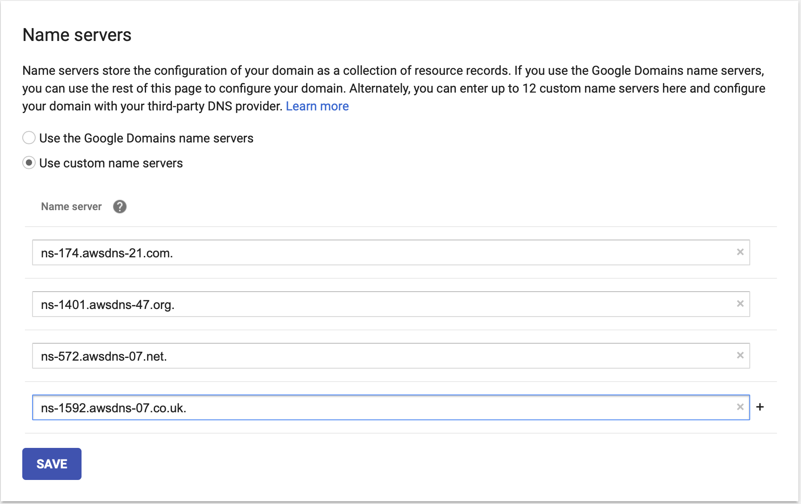
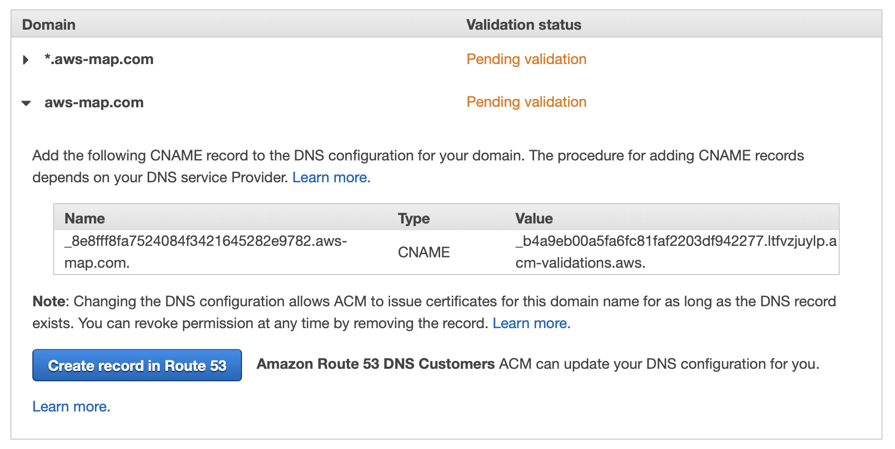
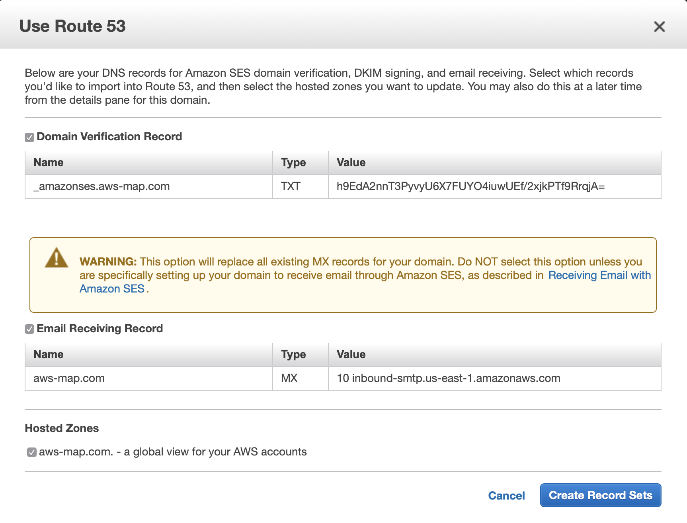

# Serverless-React-PWA-on-AWS

> How to create a serverless Progressive Web App, using React, Redux, React Router, TypeScript on frontend and AWS Lambda, Cloudfront, Amazon SES, API Gateway for a zero maintenance required backend.

## Route53

Create *your-domain.com* hosted zone and configure domain provider with AWS name servers.

On *Route53*:


On your domain provider:



## SSL Certificate

Go to *Certificate Manager* AWS service. Request an SSL certificate for _your-domain.com_ and
add also a wildcard domain _*.your-domain.com_.


Choose DNS validation option, and click on *Create record in Route 53* button
for both naked domain and wildcard domain.



## Simple Email Service

First of all, verify *your-domain.com* domain. Go to *SES > Domains* and click *Verify a New Domain*.
When the DSN records are prompted, click on *Use Route 53*.



It should take few minutes to validate. Well done! Now it's time to start coding.

## Start coding

Create your git repo and init an npm package.

```bash
npm init
```

You may want to make it private, add in your *package.json*

```json
  "private": true,
```

If it is not a package to be installed as a dependency, I also like to disable *package-lock.json*.
Create a *.npmrc* file with the following content.

```
package-lock=false
```

Of course, create a *.gitignore* file, you can start with the following content

```
node_modules
```

Before start coding, I would go for [EditorConfig](http://EditorConfig.org).
Do not think it twice, you can add a *.editorconfig* file just launching

```bash
npm i dot-editorconfig -D
```

